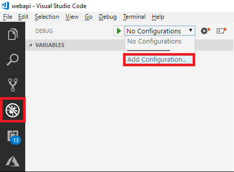
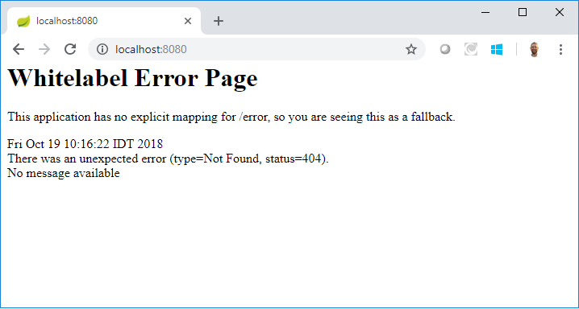

# Azure AD B2C: Java-based custom Azure AD B2C REST API

## 1. Create Java project
Use [Spring initializer](https://start.spring.io/) to create Java application. Provide the Group name and Artifact. Under the dependencies select **Web**. Click **Generate Project** and download the zip file.


### 1.1 Open the solution in VS Code
Unzip the file you download from [Spring initializer](https://start.spring.io/). Open your folder with VS Code. Click on **Debug** and from the menu select **Add Configuration**



If asked to select an environment, choose **Java**. From the created **launch.json** file, set the port number, for example,  8080 and run your project. You should see following error message because you don’t have a Controller to handle our HTTP requests.



### 1.2 Add the Java code

Add following files:
- [B2CResponseModel.java](src/main/java/com/aadb2c/webapi/B2CResponseModel.java) - This class represents the output JSON data sends back to Azure AD B2C
- [B2CResponseError.java](src/main/java/com/aadb2c/webapi/B2CResponseError.java) - Inherits from B2CResponseModel.java while adding constructor that initiates an error
- [B2CResponseError.java](src/main/java/com/aadb2c/webapi/B2CResponseError.java) - Inherits from B2CResponseModel.java while adding constructor that initiates JSON response
- [IdentityController.java](src/main/java/com/aadb2c/webapi/IdentityController.java), The Controller handles the incoming HTTP requests from Azure AD B2C. 

## 2. Run the REST API app locally
Before you deploy your solution and use it with Azure AD B2C, try to make a direct call to your REST API endpoint, using api client tool such as [Postman](https://www.getpostman.com/)

Run following POST request to your endpoint. This call should return a JSON with a random loyalty number.

```HTTP
POST http://localhost:3000/api/identity/loyalty
{
    "language": "1033",
    "objectId": "0f8fad5b-d9cb-469f-a165-70867728950e",
}
```

Run following POST request to your endpoint. This call will throw 409 HTTP error message. Change the email from `TEST@contoso.com` to `someone@contoso.com`. Now, the REST API will return a random loyalty number and the email address in lower case.
        
```HTTP
POST http://localhost:3000/api/identity/validate
{
    "language": "1033",
    "email": "TEST@contoso.com"
}
```

## 3. Deploy your app to Azure App Service
In this example, you use the [Maven Plugin for Azure App Service Web Apps](https://docs.microsoft.com/java/api/overview/azure/maven/azure-webapp-maven-plugin/readme) to deploy a Spring Boot application packaged as a Java SE JAR to Azure App Service on Linux. For more information how to deploy Java applications, see [Deploy a Spring Boot JAR file web app to Azure App Service on Linux](https://docs.microsoft.com/en-us/java/azure/spring-framework/deploy-spring-boot-java-app-with-maven-plugin).

### 3.1 Configure Maven Plugin for Azure App Service
In this section, you configure the Spring Boot project `pom.xml` so that Maven can deploy the app to Azure App Service on Linux.

1. Open `pom.xml` in a code editor.

1. In the `<build>` section of the pom.xml, locate the `<plugin>` entry with `<groupId>` **com.microsoft.azure**.

    ```xml
    <plugin>
    <groupId>com.microsoft.azure</groupId>
    <artifactId>azure-webapp-maven-plugin</artifactId>
    <version>1.4.0</version>
    <configuration>
        <deploymentType>jar</deploymentType>
    
        <!-- configure app to run on port 80, required by App Service -->
        <appSettings>
        <property> 
            <name>JAVA_OPTS</name> 
            <value>-Dserver.port=80</value> 
        </property> 
        </appSettings>
    
        <!-- Web App information -->
        <resourceGroup>${RESOURCEGROUP_NAME}</resourceGroup>
        <appName>${WEBAPP_NAME}</appName>
        <region>${REGION}</region>  
    
        <!-- Java Runtime Stack for Web App on Linux-->
        <linuxRuntime>jre8</linuxRuntime>
    </configuration>
    </plugin>
    ```
1. Update the following placeholders in the plugin configuration:

| Placeholder | Description |
| ----------- | ----------- |
| `RESOURCEGROUP_NAME` | Name for the new resource group in which to create your web app. By putting all the resources for an app in a group, you can manage them together. For example, deleting the resource group would delete all resources associated with the app. Update this value with a unique new resource group name, for example, *TestResources*. You will use this resource group name to clean up all Azure resources in a later section. |
| `WEBAPP_NAME` | The app name will be part the host name for the web app when deployed to Azure (WEBAPP_NAME.azurewebsites.net). Update this value with a unique name for the new Azure web app, which will host your Java app, for example *contoso*. |
| `REGION` | An Azure region where the web app is hosted, for example `westus2`. You can get a list of regions from the Cloud Shell or CLI using the `az account list-locations` command. |

A full list of configuration options can be found in the [Maven plugin reference on GitHub](https://github.com/Microsoft/azure-maven-plugins/tree/develop/azure-webapp-maven-plugin).

### 3.2 Install and log in to Azure CLI

The simplest and easiest way to get the Maven Plugin deploying your Spring Boot application is by using [Azure CLI](https://docs.microsoft.com/cli/azure/).
> **Note**: To sign-in to Azure, you need to close and opne your VS code.

### 3.3 Deploy the app to Azure

Once you have configured all of the settings in the preceding sections of this article, you are ready to deploy your web app to Azure. To do so, use the following steps:

1. From the command prompt or terminal window that you were using earlier, sign into your Azure account by using the Azure CLI. Follow the instructions to complete the sign-in process.
   
   ```shell
   az login
   ```
   
1. If you have multiple subscriptions, you should switch to the desired subscription:
    ```shell
    az account set --subscription "Your subscription ID or name"
    ```
    You can get a list of your subscriptions with the az account list command
    ```shell
    az account list --output table
    ```

1. Rebuild the JAR file using Maven if you made any changes to the *pom.xml* file; for example:
   ```shell
   mvn clean package
   ```

1. Deploy your web app to Azure by using Maven; for example:
   ```shell
   mvn azure-webapp:deploy
   ```

Maven will deploy your web app to Azure; if the web app or web app plan does not already exist, it will be created for you. When your web has been deployed, you will be able to manage it through the [Azure portal](https://portal.azure.com/). 

### 3.4 Test your deployment
1. Navigate to the app home page, for example: https://your-app.azurewebsites.net/. Replace the **your-app** with the value you provided to `WEBAPP_NAME`. You should see the message: 'Welcome to Azure AD B2C custom REST API'

1. Repeat on the step #2. This time, use your Azure App Service URL.

