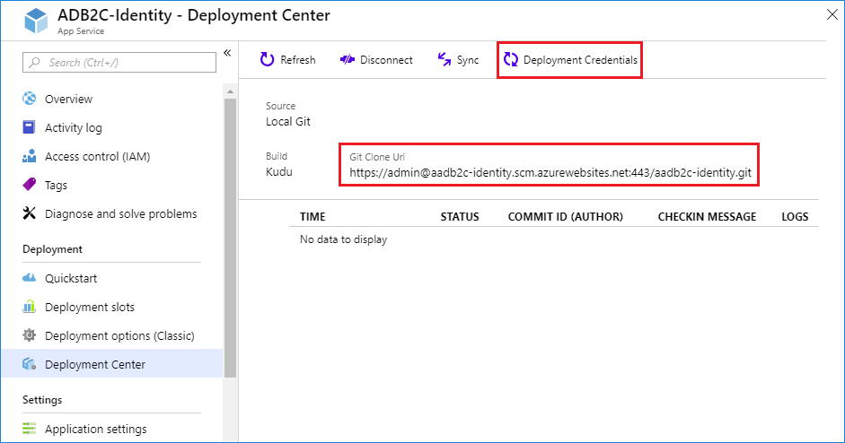

# Azure AD B2C: Python Flask based custom Azure AD B2C REST API

## Prerequisites
To successfully complete this tutorial, you must complete the [Getting Started with Python in VS Code](https://code.visualstudio.com/docs/python/python-tutorial).

## 1. Create a project environment for Flask
In this section, you create a virtual environment in which Flask is installed. Using a virtual environment avoids installing Flask into a global Python environment and gives you exact control over the libraries used in an application. A virtual environment also makes it easy to Create a requirements.txt file for the environment. For more information, see [Use Flask in Visual Studio Code](https://code.visualstudio.com/docs/python/tutorial-flask)

1. On your file system, create a project folder for this tutorial, such as **aadb2c_identity**. Navigate by entering the following commands:
	```bash
	mkdir aadb2c_identity
	cd aadb2c_identity
	```

1. In that folder, use the following command (as appropriate to your computer) to create a virtual environment named env based on your current interpreter:
    ```bash
    # macOS/Linux
    sudo apt-get install python3-venv    # If needed
    python3 -m venv env
    
    # Windows
    py -3 -m venv env
    ```
1. Open the project folder in VS Code by running `code .`, or by running VS Code and using the **File** > **Open Folder** command.

1. In VS Code, open the Command Palette (**View** > **Command Palette** or (`Ctrl+Shift+P`). Then select the **Python: Select Interpreter** command:

    

1. The command presents a list of available interpreters that VS Code can locate automatically (your list will vary; if you don't see the desired interpreter, see [Configuring Python environments](/docs/python/environments.md)). From the list, select the virtual environment in your project folder that starts with `./env` or `.\env`:

    

1. Run **Terminal: New Terminal** (`Ctrl+Shift+P`) from the Command Palette, which creates a terminal and automatically activates the virtual environment by running its activation script.

    > **Note**: on Windows, if your default terminal type is PowerShell, you may see an error that it cannot run activate.ps1 because running scripts is disabled on the system. The error provides a link for information on how to allow scripts. Otherwise, use **Terminal: Select Default Shell** to set "Command Prompt" or "Git Bash" as your default instead.

1. The selected environment appears on the left side of the VS Code status bar, and notice the "(venv)" indicator that tells you that you're using a virtual environment:

    

1. Install Flask in the virtual environment by running one of the following commands in the VS Code Terminal:

    ```bash
    # macOS/Linux
    pip3 install flask

    # Windows
    pip install flask
    ```

    > **Note**: On Windows, if you get Access Denied error message, try to run your VS Code as Adminitrator. In the **Start** type **vscode**. Right-click the **Visual Stuido Code**. Right click and select the **Run As Administrator** option. Then repeat this step.

You now have a self-contained environment ready for writing Flask code. VS Code activates the environment automatically when you use **Terminal: New Terminal**. If you open a separate command prompt or terminal, activate the environment by running `source env/bin/activate` (Linux/MacOS) or `env\scripts\activate` (Windows). You know the environment is activated when the command prompt shows **(env)** at the beginning.

## 2. Create the REST API web app

1. In VS Code, create a new file in your project folder named `application.py` using either **File** > **New** from the menu, pressing `(Ctrl+N)`, or using the new file icon in the Explorer View (shown below).

    

1. In `application.py`, copy and paste the content of the [application.py](application.py) 
1. Save the application.py file (`Ctrl+S`).
1. In the terminal, run the app by entering `python3 -m flask run` (MacOS/Linux) or `python -m flask run` (Windows), which runs the Flask development server. The development server looks for `application.py` by default. When you run Flask, you should see output similar to the following:

    ```
    (env) C:\my-projects\\aadb2c_identity>python -m flask run
     * Environment: production
       WARNING: Do not use the development server in a production environment.
       Use a production WSGI server instead.
     * Debug mode: off
     * Running on http://127.0.0.1:5000/ (Press CTRL+C to quit)
    ```

    If you see an error that the Flask module cannot be found, make sure you've run `pip3 install flask` (MacOS/Linux) or `pip install flask` (Windows) in your virtual environment as described at the end of the previous section.

    Also, if you want to run the development server on a different IP address or port, use the host and port command-line arguments, as with `--host=0.0.0.0 --port=80`. For example, following command runs the app in 8080 port:
    ```bash
    python -m flask run --port=8080
    ```

## 3. Run the REST API app locally
Before you deploy your solution and use it with Azure AD B2C, try to make a direct call to your REST API endpoint, using api client tool such as [Postman](https://www.getpostman.com/)

Run following POST request to your endpoint. This call should return a JSON with a random loyalty number.

```HTTP
POST http://localhost:3000/api/identity/loyalty
{
    "language": "1033",
    "objectId": "0f8fad5b-d9cb-469f-a165-70867728950e",
}
```

Run following POST request to your endpoint. This call will throw 409 HTTP error message. Change the email from `TEST@contoso.com` to `someone@contoso.com`. Now, the REST API will return a random loyalty number and the email address in lower case.
        
```HTTP
POST http://localhost:3000/api/identity/validate
{
    "language": "1033",
    "email": "TEST@contoso.com"
}
```

## 4. Deploy your app to Azure App Service
### 4.1 Add the requirements.txt file to your folder
If not exists, you should add the requirements.txt. Azure App Service uses this file to deploy your app with the requirement libraries

1. Run the Terminal: **New Terminal** command (`Ctrl+Shift+`) to open a terminal with that environment activated.
1. In the terminal, run `pip freeze > requirements.txt` to create the requirements.txt file in your project folder.
1. Open the **requirements.txt** file and make sure the file looks like this one. Version number may change. The names of the libraries are case-sensitive and must appear as following:
    ```bash
    click==6.7
    Flask==1.0.2
    itsdangerous==0.24
    Jinja2==2.10
    MarkupSafe==1.0
    Werkzeug==0.14.1
    ```
### 4.2 Create Azure App Service
1. In the Azure Portal, click **Create a resource > Web + Mobile > Web App**.
1. Click **Create**
1. Enter the name for your web app
1. Select your subscription.
1. Select or create a resource group.
1. For the OS (Operation System), select **Linux**
1. Select the preference **Publish** method
1. Select or create an App Service plan.
1. For the **Runtime Stack** select *Python 3.7*
1. Click **Create**.


### 4.3 Configure Deployment
In this demo, you use [Local Git Deployment to Azure App Service](https://docs.microsoft.com/en-us/azure/app-service/app-service-deploy-local-git) to deploy your code to Azure App Service. 
1. In the Azure Portal, open the App Service you created.
1. Select **Deployment Center**    
1. Select **Local Git** and click **Continue**
1. Select **App Service Kudu build server** and click **Continue**
1. Click **Finish**
1. Copy the **Git Clone Uri** 
1. Click on **Deployment Credentials**, set, and copy your **Username** and **Password**



### 4.4 Prepare your repository
To get automatic builds from the App Service Kudu build server, make sure that your repository root has the correct files in your project. Run following git commands to:
1. Init a local git repository
1. Add the files to the Git index
1. Commit the changes

```bash
git init
git add *
git commit -m "My first verstion"
```

### 4.5 Deploy the project
1. Back in the local terminal window, add an Azure remote to your local Git repository. Replace <url> with the URL of the Git remote that you got from the previous step.

    ```bash
    git remote add azure https://<username>@<app_name>.scm.azurewebsites.net/<app_name>.git
    ```
    
1. Push the changes to the **azure** remote repository
    ```bash
    git push azure master
    ```
1. When prompted for a password, make sure that you enter the password you created in step #4.3, not the password you use to log in to the Azure portal.

1. Navigate to the app home page, for example: https://addb2c-identity.azurewebsites.net/. Make sure you see the message: 'Welcome to Azure AD B2C custom REST API'

1. Repeat on the step #3. This time use your Azure App Service URL.

## Solution artifacts
- [application.py](application.py) The REST API endpoint
- [requirements.txt](requirements.txt) Containing a list of libraries to be installed using pip install 


